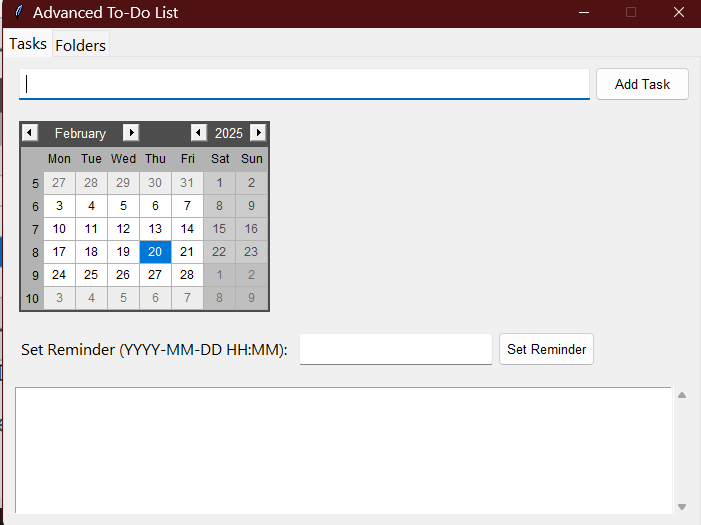
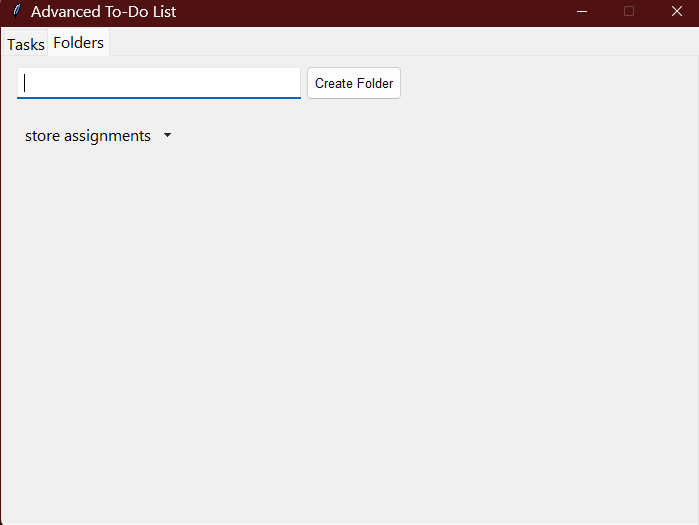

Advanced To-Do List Application
This is an advanced to-do list application built with Python and tkinter, offering features like task management, folder organization, due date selection with a calendar, reminders, and notifications.

Features
Task Management: Create, delete, and mark tasks as completed.
Folder Organization: Categorize tasks into different folders and easily move tasks between them.
Due Date Selection: Pick due dates from a calendar instead of typing manually.
Reminders: Set reminders with notifications for specific tasks.
Tabbed Interface: Easy navigation between tasks and folder management.
Save & Load: All tasks are automatically saved to tasks.json.
Installation
Ensure you have Python 3 installed.

Install the required Python packages using:

bash
Copy
Edit
pip install tkinter tkcalendar plyer
(If you're using a virtual environment, activate it first.)

Usage
Run the Application

Add Tasks:
Type your task in the task entry field.
Select a due date from the calendar (optional).
Click "Add Task" or press Enter to add the task.
Set Reminders:
Select a task from the list.
Click the "Set Reminder" button to choose a reminder date and time.
Manage Folders:
Add a new folder by entering the folder name and clicking "Create Folder".
Move tasks between folders by selecting a task and choosing the target folder.
Mark Completion:
Select a task and click "Toggle Completion" to mark it as done or undo completion.
Delete Tasks:
Select a task and click "Delete Task".

Folder Management

Tasks can be moved between folders by selecting a task and choosing the destination folder.
Easily switch between folders using the dropdown menu.

Notifications

The app will send a desktop notification for tasks with reminders when the time is reached.

File Structure

tasks.json: Stores all task data, including task details, due dates, and folder information.

Dependencies

tkinter: GUI framework for Python.
tkcalendar: Calendar widget for date selection.
plyer: Cross-platform notification support.

Known Issues & Limitations

Notifications depend on the system’s notification settings.
Ensure the reminder time is in the future to avoid errors.

Contributing

Feel free to fork the project and submit pull requests to improve the app. Suggestions and feedback are welcome!

License

This project is open-source and available under the MIT License.
